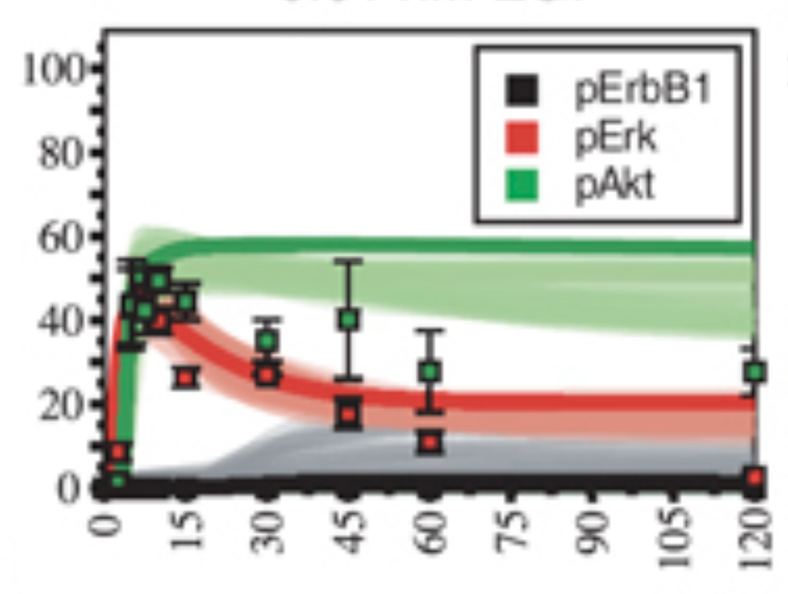
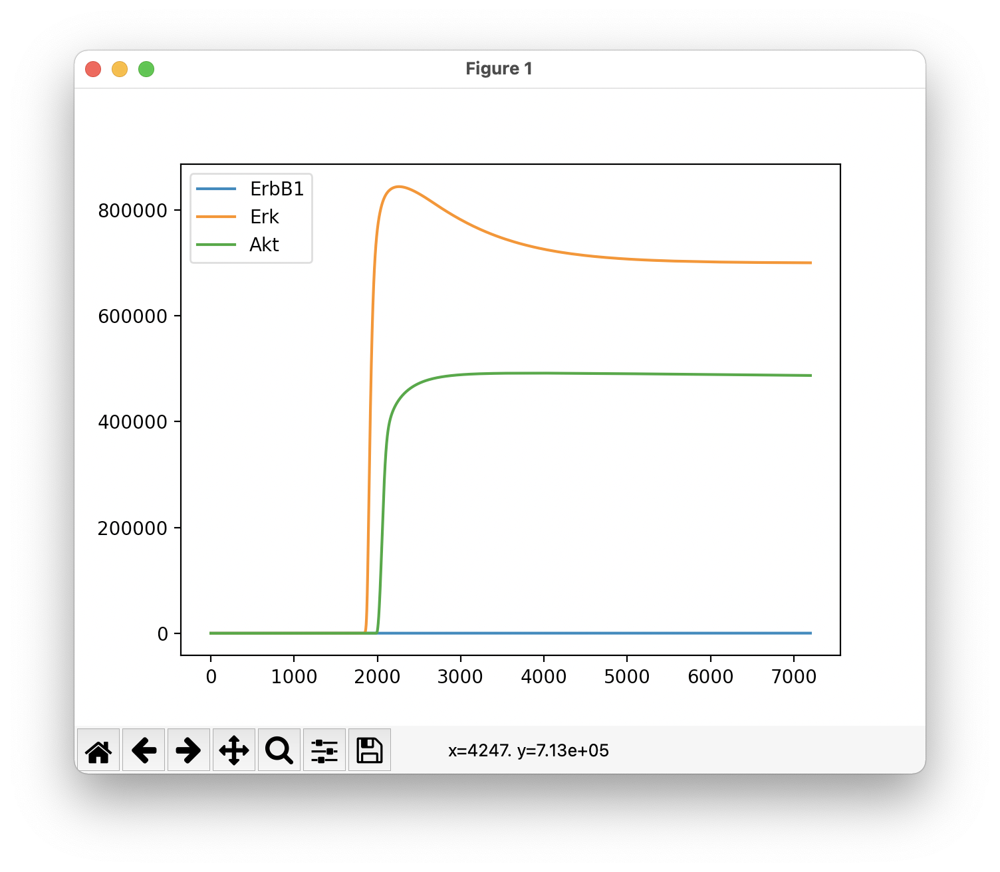
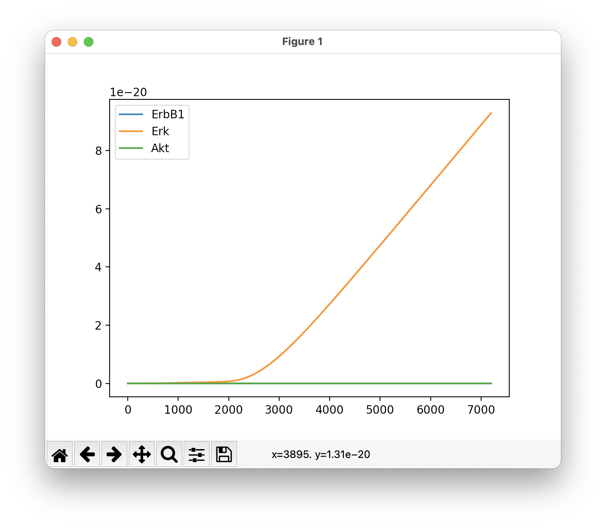

# SBML Integration Results and Challenges

The goal is to get a sense of how our system performs at state space reduction and simulation of [this ErbB Signaling model](./erb.xml) from [here](https://www.ebi.ac.uk/biomodels/BIOMD0000000255).

## State Space Reduction

Ben gave us pointers for what variables to observe in this model:
> pErbB1 = sum of all species where "2(EGF:ErbB1)#P" is in the species name string
> pErk = sum of all species where "ERK#P#P" is in the species name string
> pAkt = sum of all species where "AKT:P:P" is in the species name string

NB: in our copy of this SBML, octothorpes are rendered in species names as underscores. 

I tried pruning the model based on each of these sums, and in none of the three cases did the pruned model have fewer state variables or events than the original model.

## Simulation

Simulation of an SBML model in our framework implies conversion from SBML to ESL to Core to DEQ. The latter two paths are relatively well-tested, the former is relatively novel. I've spot-checked differential equations that result from this conversion (against [this](https://www.ebi.ac.uk/biomodels/model/download/BIOMD0000000255.2?filename=BIOMD0000000255.pdf)), and they appear correct, so I have some confidence that the translation pipeline is faithful to the original semantics.

Our ODE solution framework uses an ["[e]mbedded Runge-Kutta-Fehlberg (4, 5)"](https://hackage.haskell.org/package/hmatrix-0.10.0.1/docs/src/Numeric-GSL-ODE.html#odeSolve) simulation tactic. To simulate this model as a set of differential equations, time ranging from 0 to 7,200 by 1, took around 12.5 hours on my machine (a well-spec'd MacBook Pro).

Our discrete event simulation framework doesn't seem to be able to simulate this model correctly as it stands - we appear to evince let-bound variables as C++ struct member variables, which means they can't change with model state and time as they're semantically meant to. This results in many unexpectedly unchanging state variable values. I haven't executed a 7200-second simulation using this tactic for these reasons, expecting non-meaningful data to result in case unintentional compile-time optimizations result from this `let` bug. However, a 100-second simulation took around 16 minutes, and computation time ought to scale linearly with simulation timescale.

Ben pointed me to a tool called COPASI, which I'm treating as a reference implementation for SBML simulation. Using a deterministic simulation tactic called LSODA, on the same timescale, this tool took on the order of seconds to perform a simulation.

## Results

Our results obtained via Runge-Kutta simulation and COPASI's results obtained via LSODA simulation differ substantially. Here, for example, are two truncated data series for the (randomly-chosen) species with ID "c336" and name "(ErbB4:ErbB2)_P" (located in the plasma membrane compartment):

| time | LSODA (COPASI) | RK (ASKE-E)            |
| ---- | -------------- | ---------------------- |
| 0    | 0              | 0                      |
| 1    | 7.091450e-09   | 7.24926671311781e-12   |
| 2    | 2.543630e-08   | 5.199994513895088e-12  |
| 3    | 5.159180e-08   | 3.730037667659013e-12  |
| 4    | 8.309360e-08   | 2.675623625372657e-12  |
| 5    | 1.181790e-07   | 1.9192838474635493e-12 |
| 6    | 1.555890e-07   | 1.3767570013382146e-12 |
| 7    | 1.944250e-07   | 9.875901310086556e-13  |
| 8    | 2.340460e-07   | 7.084528740942394e-13  |
| 9    | 2.740000e-07   | 5.082210018203217e-13  |

I believe our simulation results are wrong and COPASI's are (somewhat) correct, but I believe further clarification is needed on just how correct COPASI is. This plot is from [material associated with the model online](https://www.embopress.org/cms/asset/bad78f8d-b7c3-4c33-833f-e23388237b58/msb200874-fig-0002-m.jpg), and can be taken as a sort of ground truth (the x axis is minutes, the y axis is "pSignal (normalized)")

This plot is the result of synthesizing the same observables using COPASI's results (x axis seconds, y axis the same as above (I think? The "normalized" bit gives me pause)):

This plot is the result of synthesizing the same observables using our results (same axes and caveats as above):

## Next Steps

Minimizing the problem would be wise. Using a small, handcrafted SBML model (SIR should be easy to represent) would help flush out potential bugs in the translation pipeline. Its simulation results should also be easier to compare across our tools and COPASI.

Taking a more principled approach than spot-checking ODE correctness might also be wise, in addition to or instead of the above. COPASI has an option to export ODEs, but they're represented as a C++ program, which would need to be untangled a bit.

Getting this Erb model simulable via our discrete event tactic would provide another data point (or set thereof).

One potential failure vector is the translation of SBML reactions to ESL events. The extraction of rates as we understand them from rates as SBML specifies them is a little hacky (it assumes a sum/difference of two terms, and uses the one that mentions reactants as the forward rate and the one that mentions products as the reverse rate). I discussed this with Yerim and believe it to be relatively sound, and the spot-checked ODEs do seem accurate, but nevertheless, I mention it as a weakness.

If Ben knows these models well enough, we could send him whatever data we've generated via our own various simulation tactics, as well as COPASI's, and see if he can tell offhand where we might have gone wrong, or if COPASI's off the mark.

Ben also might know why the plots I've generated using COPASI's data are sort of the same shape as the reference data, but with a substantial rightward shift in time - the y axis normalization may have something to do with that.

SBML parsing for Level 3 Version 2 files is well-tested, but Level 2 Version 3 has a distinct testing dearth. I'm relatively sure the error isn't in parsing, but more testing there could illuminate issues. One should be able to duplicate substantially the L3V2 tests for L2V3 purposes, but L2V3 does have some different syntactic constructs that would need to be addressed.