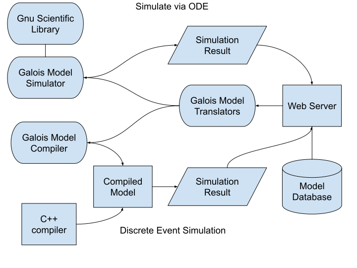

Architecture
------------

Components and Functionality
-----------------------------

* Support for multiple model representations
* Translation between model representations
* Simulation via ODE
* Generation of experiment specific discrete event simulators
* Model parameter fitting via ODE
* Comparing models with raw data
* Model storage
* Available through a web service
  <https://galoisinc.github.io/ASKE-E/donu.html>

Model Formats
-------------
* Easel
* Reaction networks
* Differential equations
* APRAM
* Gromet
* LaTeX
* Raw data

High Level Tasks
----------------

* Gromet support
* Specify custom simulation scenarios (measures etc)
* More translations between representations
* Improvements to model storage system
* Ways to search for models
* Add API for model fitting
* Add API for comparing models and data

